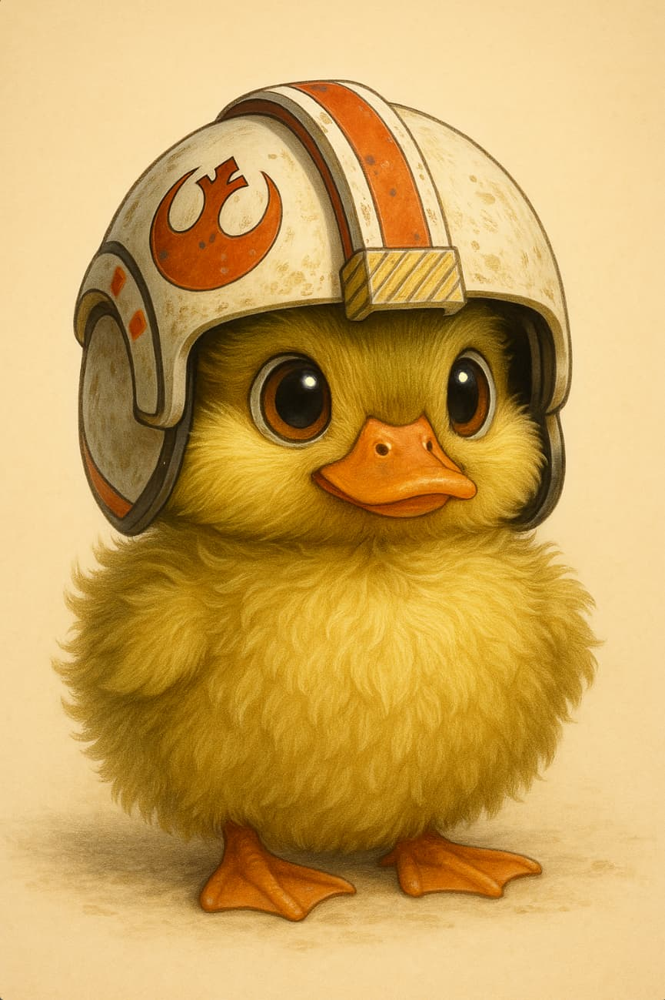

# SuperDucky

<p>
<style>#ducky-img {border-radius: 20px;}</style>
  
</p>

SuperDucky is my twitch bot!

## SuperDucky - Server

Contains the backend built with Node.js, Express, and Socket.IO.

- Listens on port `:3050`
- WebSocket server is initialized using `Socket.IO`
- Handles real-time Twitch chat commands like `!project`

## SuperDucky - Overlay

Contains the client-side application built with React and TypeScript, meant to be used as an OBS overlay.

- Connects to the server on port `:3050` via `socket.io-client`
- Real-time updates received via `projectMessage` socket event
- Socket client is configured in `socket.ts`

## Getting Started

### Requires

- Node.js (v14+ recommended)
- npm or yarn

### Installation

1. Install dependencies:

   ```bash
   npm run install-all
   ```

   This will install dependencies in root, server, and overlay directories (managed seperately).

### Running the Application

From root, you can run

```bash
npm run dev
```

The client will connect to the server on port `3050` via Socket.IO. The client application runs on `:5173`.

## Environment Variables

Use `.env` files to configure environment variables. Examples are provided as `.env-example` in both the `server` and `overlay` directories.

## Example Environment Variables

### Server (`server/.env-example`)

```env.local
HOST=localhost
PORT=3050

TWITCH_CHANNEL=your_channel_name
CLIENT_ID=your_twitch_client_id
CLIENT_SECRET=your_twitch_client_secret
ACCESS_TOKEN=your_access_token
REFRESH_TOKEN=your_refresh_token
```

### Overlay (`overlay/.env-example`)

```env
VITE_SOCKET_HOST=http://localhost:3050
```

## License

[GNU GPLv3](LICENSE)

## Development Notes

- Root scripts allow quick startup and setup:
  - `npm run install-all` installs everything
  - `npm run dev` starts both server and client together
- The server runs first to ensure the client can connect immediately
- Environment variable templates are located in each subdirectory
