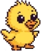

<p>
  
</p>

SuperDucky is my Twitch bot!

## TODO

- Chat bubbles
- Handle message profanity
- Handle user gets banned
- Handle user timeout (fun ideas...)
- Hatch and grow feature
- Helix emotes
- !lore command
- Possible ideas (custom chat buble, custom text color and effect, custom duck skins, accessoires, hats, different size)

## Project Structure

Contains the backend built with Node.js, Express, and Socket.IO, and the client-side application built with React and TypeScript, meant to be used as an OBS overlay.

- Listens on the port set in `.env.server.local`
- WebSocket server is initialized using `Socket.IO`
- Handles real-time Twitch chat commands like `!project`
- Connects to the server via `socket.io-client`
- Real-time updates received via `projectMessage` socket event
- Socket client is configured in `socket.ts`

## Getting Started

### Installation

From root, you can install dependencies:

```bash
npm run install-all
```

### Running the Application

After setting up the `.env.server.local` and `.env.shared.local`, from root you can run

```bash
npm run dev
```

This will start the server and the overlay concurrently.

## Environment Variables

Use `.env` files to configure environment variables. Examples are provided as `.env-example` in both the `server` and `overlay` directories.

## Example Environment Variables

Both `.env` files should be in root.

### Shared (`.env.shared.local`)

```env
# Server settings
VITE_SERVER_HOST=localhost
VITE_SERVER_PORT=your_server_port

# Frontend settings
VITE_FRONTEND_HOST=localhost
VITE_FRONTEND_PORT=your_frontend_port

# Channel to join
VITE_TWITCH_CHANNEL=your_twitch_channel
```

### Server-only (`.env.server.local`)

```env
# Twitch auth
CLIENT_ID=your_twitch_client_id
CLIENT_SECRET=your_twitch_client_secret
ACCESS_TOKEN=your_access_token
REFRESH_TOKEN=your_refresh_token
```

## License

[GNU GPLv3](LICENSE)